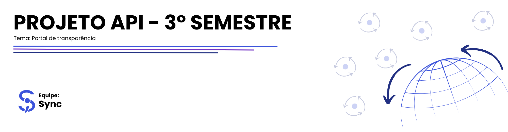
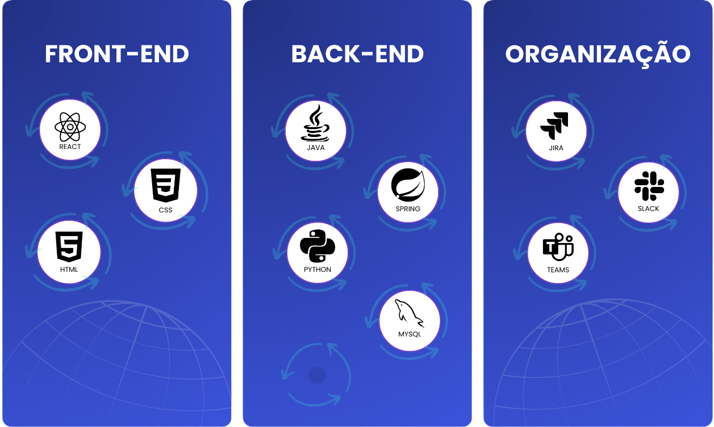

<h2 id='topo'></h2>

<a href="#objetivo"> 🎯 Objetivo </a> |
<a href="#proposta"> 📧 Proposta de Solução </a> |
<a href="#requisitos"> 📚 Requisitos do Parceiro </a> |
<a href="#product-backlog"> 📖 Product Backlog </a> |
<a href="#dor"> DoR </a> |
<a href="#dod"> DoD </a> |
<a href="#mvp"> 📎 MVP </a> |
<a href="#sprints"> 📌 Sprints </a> |
<a href="#tecnologias"> 💻 Tecnologias </a> |
<a href="#manual-usuario"> 📃 Manual do Usuário </a> |
<a href="#padroes-de-commit"> 📨 Padrões de Commit </a> |
<a href="#membros"> 👥 Membros </a> 

 

<h2 id='objetivo'> 🎯 Objetivo </h2>
Este projeto tem como objetivo desenvolver um portal de transparência para a Fundação de Apoio à Pesquisa de Pós-Graduandos (FAPG). Nossa meta é entregar uma plataforma robusta e eficiente, com funcionalidades que permitam a inserção de projetos, a realização de buscas avançadas por meio de filtros e a geração de estatísticas apresentadas em gráficos interativos, promovendo um acesso transparente e facilitado às informações públicas.

 

<h2 id='proposta'> 📧 Proposta de Solução </h2>
Nossa proposta é desenvolver um sistema moderno e eficiente, utilizando novas tecnologias, permitindo a adição e o gerenciamento ágil de projetos.

Arquitetura de Microserviços: Garantiremos flexibilidade e escalabilidade com uma estrutura modular, facilitando a manutenção e a expansão futura do sistema.

Gestão Eficiente de Projetos: Usuários poderão adicionar, monitorar e gerenciar projetos de forma simples, com uma interface que permite a visualização detalhada dos projetos.

Painel Intuitivo: Desenvolveremos um painel de controle simples e intuitivo, com gráficos interativos que facilitam a compreensão rápida e clara das informações.

 

<h2 id='requisitos'> 📚 Requisitos do Parceiro </h2>

| Número | Requisito do Parceiro |
| ------ | --------------------- |
| 1 | Ferramenta de importação de dados da aplicação legada no novo banco de dados projetado |
| 2 | Interface para cadastro de novos projetos |
| 3 | Interface de pesquisa de projetos |
| 4 | Interface de cadastro de usuários |
| 5 | Relatórios/dashboards de projetos desenvolvidos, com diferentes tipos de filtros |

 

<h2 id='product-backlog'> 📖 Product Backlog </h2>

<table>
    <thead>
        <tr align="center">
            <th>Rank</th>
            <th>Prioridade</th>
            <th>User Story</th>
            <th>Planning Poker</th>
            <th>Sprint</th>
            <th>Req. Parceiro</th>
        </tr>
    </thead>
    <tbody>
        <tr align="center">
            <td>1</td>
            <td>ALTA</td>
            <td>Como administrador, eu quero acessar um portal exclusivo da área do administrador, para gerenciar projetos e visualizar relatórios detalhados, garantindo a manutenção e a segurança dos dados do sistema.</td>
            <td>8</td>
            <td>1</td>
            <td>4</td>
        </tr>
        <tr align="center">
            <td>2</td>
            <td>ALTA</td>
            <td>Como administrador, eu quero cadastrar projetos, para que eles estejam disponíveis no Portal de Transparência.</td>
            <td>8</td>
            <td>1</td>
            <td>2</td>
        </tr>
        <tr align="center">
            <td>3</td>
            <td>ALTA</td>
            <td>Como administrador, eu quero importar dados da aplicação legada, para garantir que os projetos antigos estejam acessíveis no novo portal.</td>
            <td>13</td>
            <td>1</td>
            <td>4</td>
        </tr>
        <tr align="center">
            <td>4</td>
            <td>ALTA</td>
            <td>Como usuário, eu quero visualizar os projetos no Portal de Transparência.</td>
            <td>5</td>
            <td>1</td>
            <td>3</td>
        </tr>
        <tr align="center">
            <td>5</td>
            <td>ALTA</td>
            <td>Como usuário, eu quero visualizar os detalhes completos de um projeto ao selecioná-lo na pesquisa, para entender todos os aspectos do projeto.</td>
            <td>5</td>
            <td>1</td>
            <td>3</td>
        </tr>
        <tr align="center">
            <td>6</td>
            <td>MÉDIA</td>
            <td>Como usuário, eu quero pesquisar projetos por coordenador, para encontrar informações específicas.</td>
            <td>5</td>
            <td>2</td>
            <td>3</td>
        </tr>
        <tr align="center">
            <td>7</td>
            <td>MÉDIA</td>
            <td>Como usuário, eu quero pesquisar projetos por empresa, para encontrar informações específicas.</td>
            <td>5</td>
            <td>2</td>
            <td>3</td>
        </tr>
        <tr align="center">
            <td>8</td>
            <td>MÉDIA</td>
            <td>Como usuário, eu quero pesquisar projetos por status (em andamento, encerrados e não iniciados), para acompanhar o progresso dos projetos.</td>
            <td>5</td>
            <td>2</td>
            <td>3</td>
        </tr>
        <tr align="center">
            <td>9</td>
            <td>MÉDIA</td>
            <td>Como usuário, eu quero pesquisar projetos por classificação, para acompanhar o progresso dos projetos.</td>
            <td>5</td>
            <td>2</td>
            <td>3</td>
        </tr>
        <tr align="center">
            <td>10</td>
            <td>MÉDIA</td>
            <td>Como usuário, eu quero pesquisar projetos por data de início ou término, para encontrar informações específicas.</td>
            <td>5</td>
            <td>2</td>
            <td>3</td>
        </tr>
        <tr align="center">
            <td>11</td>
            <td>MÉDIA</td>
            <td>Como usuário, eu quero utilizar uma barra de pesquisa para buscar conteúdos no site com base em palavras-chave, para encontrar informações de maneira rápida e eficiente.</td>
            <td>5</td>
            <td>2</td>
            <td>3</td>
        </tr>
        <tr align="center">
            <td>12</td>
            <td>MÉDIA</td>
            <td>Como administrador, eu quero editar projetos existentes, para manter as informações atualizadas.</td>
            <td>3</td>
            <td>2</td>
            <td>2</td>
        </tr>
        <tr align="center">
            <td>13</td>
            <td>MÉDIA</td>
            <td>Como administrador, eu quero excluir projetos obsoletos ou incorretos, para manter os dados atualizados.</td>
            <td>3</td>
            <td>2</td>
            <td>2</td>
        </tr>
        <tr align="center">
            <td>14</td>
            <td>MÉDIA</td>
            <td>Como administrador, eu quero visualizar uma lista dos projetos que estão próximos da data de conclusão,
Para que eu possa gerenciar as datas e tomar ações necessárias com antecedência.</td>
            <td>3</td>
            <td>2</td>
            <td>2</td>
        </tr>
        <tr align="center">
            <td>15</td>
            <td>MÉDIA</td>
            <td>Como administrador, eu quero garantir que conteúdo sensível de projetos não seja exibido para usuários comuns,
para proteger informações confidenciais e garantir que apenas usuários autorizados tenham acesso.</td>
            <td>5</td>
            <td>3</td>
            <td>2</td>
        </tr>
        <tr align="center">
            <td>16</td>
            <td>MÉDIA</td>
            <td>Como administrador, eu quero visualizar dashboards dos projetos, para obter uma visão geral e rápida do estado dos projetos.</td>
            <td>8</td>
            <td>3</td>
            <td>5</td>
        </tr>
        <tr align="center">
            <td>17</td>
            <td>MÉDIA</td>
            <td>Como administrador, eu quero visualizar um histórico de alterações de cada projeto, para rastrear todas as edições realizadas e garantir a integridade dos dados.</td>
            <td>8</td>
            <td>3</td>
            <td>2</td>
        </tr>
        <tr align="center">
            <td>18</td>
            <td>MÉDIA</td>
            <td>Como administrador, eu quero exportar os dados dos dashboards dos projetos, para obter uma visão geral e rápida do estado dos projetos.</td>
            <td>8</td>
            <td>3</td>
            <td>5</td>
        </tr>
        <tr align="center">
            <td>19</td>
            <td>MÉDIA</td>
            <td>Como administrador, eu quero exportar dados de um projeto selecionado, para obter uma visão geral e rápida do estado do projeto.</td>
            <td>8</td>
            <td>3</td>
            <td>5</td>
        </tr>
        <tr align="center">
            <td>20</td>
            <td>MÉDIA</td>
            <td>Como administrador, eu quero salvar um rascunho no cadastro de projetos para que eu possa continuar o preenchimento posteriormente antes de publicar o projeto.</td>
            <td>3</td>
            <td>4</td>
            <td>2</td>
        </tr>
        <tr align="center">
            <td>21</td>
            <td>MÉDIA</td>
            <td>Como administrador, eu quero salvar um rascunho ao editar um projeto existente para que eu possa revisar as mudanças antes de publicá-las.</td>
            <td>3</td>
            <td>4</td>
            <td>2</td>
        </tr>
        <tr align="center">
            <td>22</td>
            <td>MÉDIA</td>
            <td>Como administrador, eu quero ver uma lista de todos os rascunhos de projetos, para que eu possa identificar quais projetos estão com dados pendentes ao cadastrar e editar.</td>
            <td>3</td>
            <td>4</td>
            <td>2</td>
        </tr>
        <tr align="center">
            <td>23</td>
            <td>MÉDIA</td>
            <td>Como administrador, eu quero poder editar um rascunho de projeto para atualizar ou concluir as informações antes de publicá-lo.</td>
            <td>3</td>
            <td>4</td>
            <td>2</td>
        </tr>
        <tr align="center">
            <td>24</td>
            <td>MÉDIA</td>
            <td>Como administrador, eu quero excluir um rascunho de projeto para remover rascunhos desnecessários ou incorretos do sistema.</td>
            <td>3</td>
            <td>4</td>
            <td>2</td>
        </tr>
        <tr align="center">
            <td>25</td>
            <td>BAIXA</td>
            <td>Como administrador, eu quero receber uma notificação por e-mail no dia que o projeto estiver de expirar para que eu possa tomar ações preventivas.</td>
            <td>3</td>
            <td>4</td>
            <td>2</td>
        </tr>
        <tr align="center">
            <td>26</td>
            <td>BAIXA</td>
            <td>Como administrador, eu quero registrar informações de bolsistas, incluindo dados pessoais, tipo de bolsa, duração e área de atuação, e vinculá-los a um projeto.</td>
            <td>5</td>
            <td>4</td>
            <td>4</td>
        </tr>
        <tr align="center">
            <td>27</td>
            <td>BAIXA</td>
            <td>Como administrador, eu quero ver uma lista de todos os bolsistas registrados, para visualizar rapidamente as informações de cada um.</td>
            <td>3</td>
            <td>4</td>
            <td>4</td>
        </tr>
        <tr align="center">
            <td>28</td>
            <td>BAIXA</td>
            <td>Como administrador, eu quero poder editar as informações de um bolsista para manter os dados atualizados.</td>
            <td>5</td>
            <td>4</td>
            <td>4</td>
        </tr>
        <tr align="center">
            <td>29</td>
            <td>BAIXA</td>
            <td>Como administrador, eu quero poder excluir bolsistas do sistema para remover registros desatualizados ou incorretos.</td>
            <td>3</td>
            <td>4</td>
            <td>4</td>
        </tr>
        <tr align="center">
            <td>30</td>
            <td>BAIXA</td>
            <td>Como administrador, eu quero ter a opção de gerar um plano de trabalho ao cadastrar um projeto para anexá-lo ao acordo de parceria para pesquisa e desenvolvimento entre a empresa e a fundação.</td>
            <td>5</td>
            <td>4</td>
            <td>2</td>
        </tr>
        <tr align="center">
            <td>31</td>
            <td>BAIXA</td>
            <td>Como administrador, eu quero que o plano de trabalho preencha automaticamente campos específicos de um modelo Word, para facilitar a criação do documento.</td>
            <td>8</td>
            <td>4</td>
            <td>2</td>
        </tr>
        <tr align="center">
            <td>32</td>
            <td>BAIXA</td>
            <td>Como administrador, eu quero que o plano de trabalho gerado seja salvo e acessível no sistema para futuras consultas e revisões.</td>
            <td>5</td>
            <td>4</td>
            <td>2</td>
        </tr>
        <tr align="center">
            <td>33</td>
            <td>BAIXA</td>
            <td>Como administrador, eu quero poder criar um contrato com as informações do contratante, pesquisador, prazos e valores, para formalizar o acordo de parceria entre a empresa e a fundação.</td>
            <td>5</td>
            <td>4</td>
            <td>2</td>
        </tr>
        <tr align="center">
            <td>34</td>
            <td>BAIXA</td>
            <td>Como administrador, eu quero que o contrato preencha automaticamente campos específicos de um modelo Word, para facilitar a criação do documento.</td>
            <td>8</td>
            <td>4</td>
            <td>2</td>
        </tr>
        <tr align="center">
            <td>35</td>
            <td>BAIXA</td>
            <td>Como administrador, eu quero que o contrato gerado seja salvo e acessível no sistema para futuras consultas e revisões.</td>
            <td>5</td>
            <td>4</td>
            <td>2</td>
        </tr>
    </tbody>
</table>

 

<h2 id='dor'> DoR (Definitions of Ready) </h2>

### User Stories
- Definidas e compreendidas por todos.
- Pequenas o suficiente para serem feitas em uma sprint.

### Critério de Aceitação
- Mensurável e testável.
- Descreve claramente quando a funcionalidade está completa.

### Tarefas
- Identificadas e documentadas para cada User Story.
- Cada tarefa possui um responsável designado.

### Modelo de Dados
- Definido e documentado.
- Campos, tipos de dados e relações claramente especificados.

 

<h2 id='dod'> DoD (Definition of Done) </h2>

### Código
- Implementa todos os critérios de aceitação.
- Todos os testes implementados e executados com sucesso.

### Commit
- Documentados com mensagens claras e descritivas.
- Seguem o padrão de nomenclatura acordado pela equipe.

### Mockups
- Mockups na interface funcionam conforme esperado.
- Experiência do usuário corresponde aos critérios definidos.

### Manual do Usuário
- Completo e disponível online.
- Inclui instruções de como usar todas as funcionalidades do produto.

### Guia de Instalação
- Detalha todos os passos para configuração e instalação.
- Inclui requisitos de sistema, dependências e configurações de software/hardware.

 

<h2 id='mvp'>📎 MVP</h2>
<video src="https://github.com/user-attachments/assets/1f5b4ffa-f209-4c18-b8c3-363f96898a95"></video>

<h2 id='sprints'> 📌 Sprints </h2>

<table>
  <thead>
    <tr align="center">
      <th>Sprints</th>
      <th>Data de Início</th>
      <th>Data de Término</th>
      <th>Documentos</th>
      <th>Status</th>
    </tr>
  </thead>
 <tbody>
  <tr align="center">
    <td>01</td>
    <td>09/09/2024</td>
    <td>29/09/2024</td>
    <td><a href="https://github.com/Sync-FATEC/API-2024.2-3SEM/tree/main/sprints/sprint01/sprint01.md">Relatório</a></td> 
    <td>✅</td>
  </tr>
  <tr align="center">
    <td>02</td>
    <td>30/09/2024</td>
    <td>20/10/2024</td>
    <td><a href="https://github.com/Sync-FATEC/API-2024.2-3SEM/tree/main/sprints/sprint02/sprint02.md">Relatório</a></td> 
    <td>✅</td>
  </tr>
  <tr align="center">
    <td>03</td>
    <td>21/10/2024</td>
    <td>10/11/2024</td>
    <td><a href="https://github.com/Sync-FATEC/API-2024.2-3SEM/tree/main/sprints/sprint03/sprint03.md">Relatório</a></td> 
    <td>✅</td>
  </tr>
  <tr align="center">
    <td>04</td>
    <td>11/11/2024</td>
    <td>01/12/2024</td>
    <td><a href="https://github.com/Sync-FATEC/API-2024.2-3SEM/tree/main/sprints/sprint04/sprint04.md">Relatório</a></td> 
    <td>✅</td>
  </tr>
</tbody>
</table>

 

<h2 id='manual-usuario'> 📃 Manual do Usuário </h2>
<a href="https://github.com/Sync-FATEC/API-2024.2-3SEM/blob/main/documentacao/ManualdoUsuario.pdf">Clique Aqui</a>

 

<h2 id='tecnologias'> 💻 Tecnologias </h2>

 

<h2 id='padroes-de-commit'> 📨 Padrões de Commit </h2>

 

<h2 id='membros'> 👥 Membros </h2>

| Foto | Nome | Função | Github | Linkedin |
| :---------: | :---------: | :---------------------: | :-----------------: | :-------: |
|  | Kauê Francisco | Scrum Master |  |  |
|  | Ana Laura Moratelli | Product Owner |  |  |
|  | Claudio Jayme | Desenvolvedor |  |  |
|  | Erik Yokota | Desenvolvedor |  |  |
|  | Elisa Rachel | Desenvolvedora |  |  |
|  | João Gabriel Solis | Desenvolvedor |  |  |
|  | Joyce Silva | Desenvolvedora |  |  |
|  | Julia Maria | Desenvolvedora |  |  |
|  | Yuri Braga | Desenvolvedor |  |  |

<a href='#topo'> Voltar ao topo </a>
