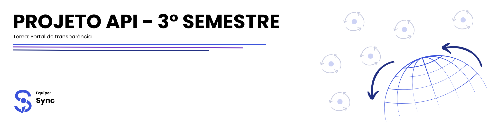
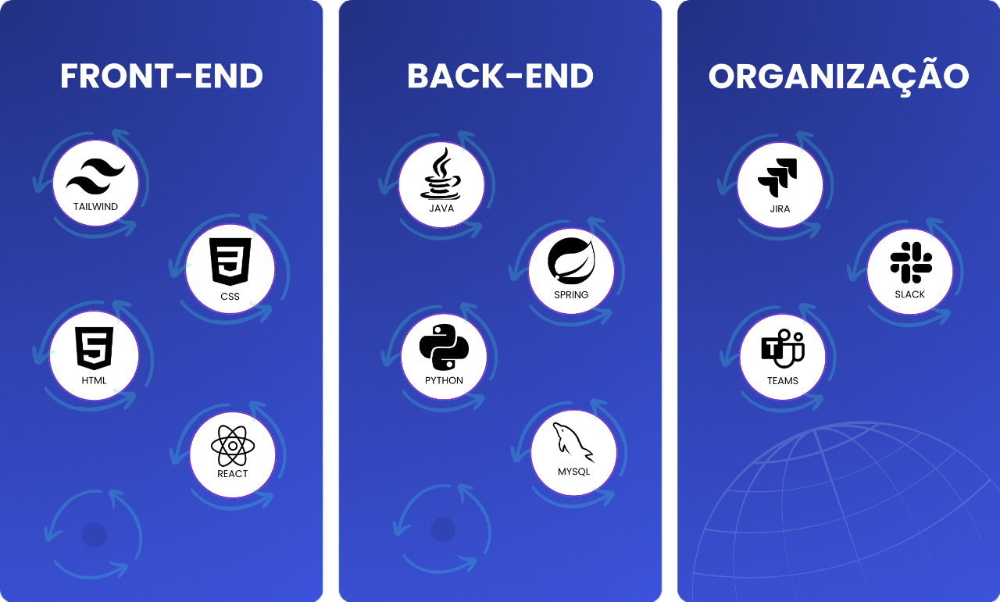
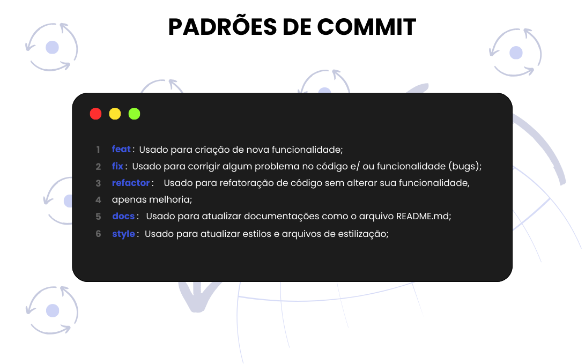

<h2 id='topo'></h2>

<a href="#objetivo"> 🎯 Objetivo </a> |
<a href="#proposta"> 📧 Proposta de Solução </a>
<a href="#requisitos"> 📚 Requisitos do Parceiro </a> |
<a href="#product-backlog"> 📖 Product Backlog </a> |
<a href="#dor"> DoR </a> |
<a href="#dod"> DoD </a> |
<a href="#sprints"> 📌 Sprints </a> |
<a href="#tecnologias"> 💻 Tecnologias </a> |
<a href="#manual-usuario"> 📃 Manual do Usuário </a> |
<a href="#padroes-de-commit"> 📨 Padrões de Commit </a> |
<a href="#membros"> 👥 Membros </a> 

 

<h2 id='objetivo'> 🎯 Objetivo </h2>
Este projeto tem como objetivo desenvolver um portal de transparência para a Fundação de Apoio à Pesquisa de Pós-Graduandos (FAPG). Nossa meta é entregar uma plataforma robusta e eficiente, com funcionalidades que permitam a inserção de projetos, a realização de buscas avançadas por meio de filtros e a geração de estatísticas apresentadas em gráficos interativos, promovendo um acesso transparente e facilitado às informações públicas.

 

<h2 id='proposta'> 📧 Proposta de Solução </h2>
Nossa proposta é desenvolver um sistema moderno e eficiente, utilizando novas tecnologias, permitindo a adição e o gerenciamento ágil de projetos.

Arquitetura de Microserviços: Garantiremos flexibilidade e escalabilidade com uma estrutura modular, facilitando a manutenção e a expansão futura do sistema.

Gestão Eficiente de Projetos: Usuários poderão adicionar, monitorar e gerenciar projetos de forma simples, com uma interface que permite a visualização detalhada dos projetos.

Painel Intuitivo: Desenvolveremos um painel de controle simples e intuitivo, com gráficos interativos que facilitam a compreensão rápida e clara das informações.

 

<h2 id='requisitos'> 📚 Requisitos do Parceiro </h2>

| Número | Requisito do Parceiro |
| ------ | --------------------- |
| 1 | Ferramenta de importação de dados da aplicação legada no novo banco de dados projetado |
| 2 | Interface para cadastro de novos projetos |
| 3 | Interface de pesquisa de projetos |
| 4 | Interface de cadastro de usuários |
| 5 | Relatórios/dashboards de projetos desenvolvidos, com diferentes tipos de filtros |

 

<h2 id='product-backlog'> 📖 Product Backlog </h2>

| Rank | Prioridade  | User Story                                              | Estimativa | Sprint    | Req. Parceiro |
|----|-------|-----------------------------------------------------------------|------------|-----------|---------------|
| 01 | Alta  | Como administrador, eu quero acessar um portal exclusivo da área do administrador, para gerenciar projetos e visualizar relatórios detalhados, garantindo a manutenção e a segurança dos dados do sistema.        | 8 | 1 | 4 |
| 02 | Alta  | Como administrador, eu quero cadastrar projetos, para que eles estejam disponíveis no Portal de Transparência.      | 8 | 1 | 2 |
| 03 | Alta  | Como administrador, eu quero importar dados da aplicação legada, para garantir que os projetos antigos estejam acessíveis no novo portal. | 13 | 1 | 4 |
| 04 | Alta  | Como usuário, eu quero visualizar os projetos no Portal de Transparência.      | 5 | 1 | 3 |
| 05 | Alta | Como usuário, eu quero visualizar os detalhes completos de um projeto ao selecioná-lo na pesquisa, para entender todos os aspectos do projeto.       | 5 | 1 | 3 |
| 06 | Media | Como usuário, eu quero pesquisar projetos por coordenador, para encontrar informações específicas.       | 5  | 2 | 3 |
| 07 | Media | Como usuário, eu quero pesquisar projetos por empresa, para encontrar informações específicas.       | 5 | 2 | 3 |
| 08 | Media | Como usuário, eu quero pesquisar projetos por status (em andamento, encerrados e não iniciados), para acompanhar o progresso dos projetos.       | 5 | 2 | 3 |
| 09 | Media | Como usuário, eu quero pesquisar projetos por classificação, para acompanhar o progresso dos projetos.       | 5 | 2 | 3 |
| 10 | Media | Como usuário, eu quero pesquisar projetos por data de início ou término, para encontrar informações específicas.       | 5 | 2 | 3 |
| 11 | Media | Como usuário, eu quero utilizar uma barra de pesquisa para buscar conteúdos no site com base em palavras-chave, para encontrar informações de maneira rápida e eficiente.  | 5 | 2 | 3 |
| 12 | Media | Como administrador, eu quero editar projetos existentes, para manter as informações atualizadas.       | 3 | 3 | 2 |
| 13 | Media | Como administrador, eu quero excluir projetos obsoletos ou incorretos, para manter os dados atualizados.       | 3 | 3 | 2 |
| 14 | Media | Como administrador, eu quero visualizar dashboards dos projetos, para obter uma visão geral e rápida do estado dos projetos.       | 8 | 3 | 5 |
| 15 | Baixa | Como administrador, eu quero exportar os dados do dashboards dos projetos, para obter uma visão geral e rápida do estado dos projetos.       | 8 | 4 | 5 |
| 16 | Baixa | Como administrador, eu quero exportar dados de um projeto selecionado,  para obter uma visão geral e rápida do estado do projeto.       | 8 | 4 | 5 |

 

<h2 id='dor'> DoR (Definitions of Ready) </h2>

### User Stories
- Definidas e compreendidas por todos.
- Pequenas o suficiente para serem feitas em um sprint.

### Critério de Aceitação
- Mensurável e testável.
- Descreve claramente quando a funcionalidade está completa.

### Tarefas
- Tarefas identificadas e documentadas para cada história.
- Cada tarefa tem um responsável definido.

### Modelo de Dados
- Modelo de dados definido e documentado.
- Campos, tipos de dados e relações claramente especificados.

 

<h2 id='dod'> DoD (Definition of Done) </h2>

### Código
- Completo e implementa todos os critérios de aceitação.
- Todos os testes escritos e passando com sucesso.

### Commit
- Todos os commits estão devidamente documentados com mensagens claras e descritivas.
- Os commits seguem o padrão de nomenclatura acordado pela equipe (ex: "feat:", "fix:").

### Mockups
- Mockups na interface funcionam conforme esperado.
- Experiência do usuário corresponde aos critérios definidos.

### Manual do Usuário
- O manual do usuário está completo e disponível online.
- Inclui instruções passo a passo sobre como usar todas as funcionalidades do produto.

### Guia de Instalação
- O guia de instalação detalha todos os passos necessários para configurar e instalar o software em diferentes plataformas ou ambientes.
- Inclui requisitos de sistema, dependências e configurações de software/hardware.

 

<h2 id='sprints'> 📌 Sprints </h2>

| Sprints | Data de Inicio | Data de Entrega |Documentos | Status |
| ------- | -------------- | --------------- | --------- | ------ |
| Sprint 1 | 09/09/2024 | 29/09/2024 | Em desenvolvimento! | 🔁 |
| Sprint 2 | 30/09/2024 | 20/10/2024 | Em desenvolvimento! | ❌ |
| Sprint 3 | 21/10/2024 | 10/11/2024 | Em desenvolvimento! | ❌ |
| Sprint 4 | 11/11/2024 | 01/12/2024 | Em desenvolvimento! | ❌ |

 

<h2 id='manual-usuario'> 📃 Manual do Usuário </h2>
Em desenvolvimento!

 

<h2 id='tecnologias'> 💻 Tecnologias </h2>

 

<h2 id='padroes-de-commit'> 📨 Padrões de Commit </h2>

 

<h2 id='membros'> 👥 Membros </h2>

| Foto | Nome | Função | Github | Linkedin |
| :---------: | :---------: | :---------------------: | :-----------------: | :-------: |
|  | Kauê Francisco | Scrum Master |  |  |
|  | Ana Laura Moratelli | Product Owner |  |  |
|  | Erik Yokota | Desenvolvedor |  |  |
|  | João Gabriel Solis | Desenvolvedor |  |  |
|  | Joyce Silva | Desenvolvedora |  |  |
|  | Yuri Braga | Desenvolvedor |  |  |

<a href='#topo'> Voltar ao topo </a>
